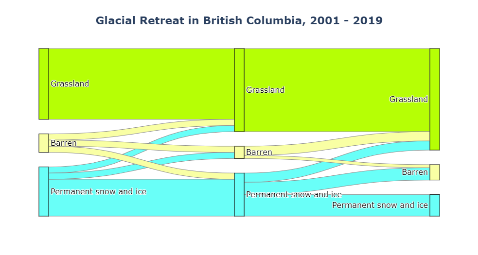
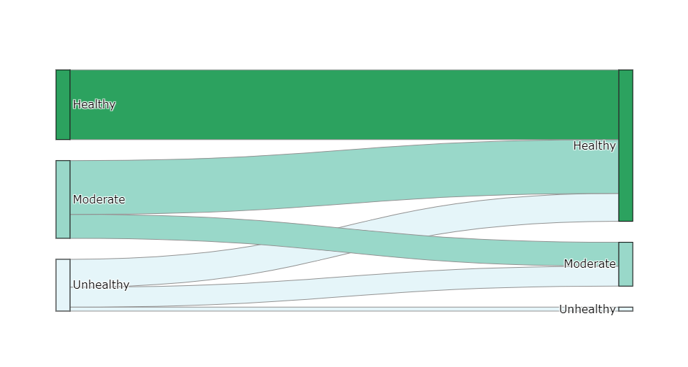

# sankee
Visualize classified time series data with interactive Sankey plots in Google Earth Engine

[](https://htmlpreview.github.io/?https://github.com/aazuspan/sankee/main/examples/MODIS.html)


## Description
`sankee` provides a dead-simple API that combines the power of [GEE](https://github.com/google/earthengine-api) and [Plotly](https://github.com/plotly/plotly.py) to visualize changes in land cover, plant health, burn severity, or any other classified imagery over a time series in a region of interst using interactive Sankey plots. Use a library of built-in datasets like NLCD, MODIS Land Cover, or CGLS for convenience or define your own custom datasets for flexibility.

## Installation
```
pip install sankee
```

## Requirements
- An authenticated GEE Python environment ([offical guide](https://developers.google.com/earth-engine/guides/python_install))

## Quick start 
### Using a Premade Dataset
Datasets in `sankee` are used to apply labels and colors to classified imagery. `sankee` includes premade `Dataset` objects for common classified datasets in GEE like NLCD, MODIS land cover, and CGLS. See [datasets](https://github.com/aazuspan/sankee#Datasets) for a detailed explanation.
```python
import ee
import sankee

ee.Initialize()

# Choose a premade dataset object contains band, label, and palette information for NLCD
dataset = sankee.datasets.NLCD2016

# Build a list of images
img_list = [ee.Image(f"USGS/NLCD/NLCD2001"), ee.Image(f"USGS/NLCD/NLCD2016")]
# Build a matching list of labels for the images (optional)
label_list = ["2001", "2016"]

# Define an area of interest
vegas = ee.Geometry.Polygon(
        [[[-115.4127152226893, 36.29589873319828],
          [-115.4127152226893, 36.12082334399102],
          [-115.3248245976893, 36.12082334399102],
          [-115.3248245976893, 36.29589873319828]]])

# Choose a title to display over your plot (optional)
title = "Las Vegas Urban Sprawl, 2001 - 2016"

# Generate your Sankey plot
plot = sankee.sankify(img_list, vegas, label_list, dataset, max_classes=4, title=title)
```
[](https://htmlpreview.github.io/?https://github.com/aazuspan/sankee/main/examples/NLCD.html)

### Using a Custom Dataset
Datasets can also be manually defined for custom datasets. In this example, we'll classify 1-year and 5-year post-fire Landsat imagery using NDVI and visualize plant recovery using `sankee`.
```python
import ee
import sankee

ee.Initialize()

# Load fire perimeters from MTBS data
fires = ee.FeatureCollection("users/aazuspan/fires/mtbs_1984_2018")
# Select the 2014 Happy Camp Complex fire perimeter in California
fire = fires.filterMetadata("Fire_ID", "equals", "CA4179612337420140814")

# Load imagery 1 year after fire and 5 years after fire
immediate = ee.Image("LANDSAT/LC08/C01/T1_TOA/LC08_045031_20150718")
recovery = ee.Image("LANDSAT/LC08/C01/T1_TOA/LC08_046031_20200807")

# Calculate NDVI
immediate_NDVI = immediate.normalizedDifference(["B5", "B4"])
recovery_NDVI = recovery.normalizedDifference(["B5", "B4"])

# Reclassify continuous NDVI values into classes of plant health
immediate_class = ee.Image(1) \
  .where(immediate_NDVI.lt(0.3), 0) \
  .where(immediate_NDVI.gt(0.5), 2) \
  .rename("health")

recovery_class = ee.Image(1) \
  .where(recovery_NDVI.lt(0.3), 0) \
  .where(recovery_NDVI.gt(0.5), 2) \
  .rename("health")

# Specify the band name for the image
band = "health"

# Assign labels to the pixel values defined above
labels = {
    0: "Unhealthy",
    1: "Moderate",
    2: "Healthy"
}
# Assign colors to the pixel values defined above
palette = {
    0: "#e5f5f9",
    1: "#99d8c9",
    2: "#2ca25f"
}

# Define the images to use and create labels to describe them
img_list = [immediate_class, recovery_class]
label_list = ["Immediate", "Recovery"]

# Generate your Sankey plot
plot = sankee.sankify(img_list, fire, label_list, band=band, labels=labels, palette=palette, scale=20)
```
[](https://htmlpreview.github.io/?https://github.com/aazuspan/sankee/main/examples/NDVI.html)


### Datasets

Datasets in `sankee` define how classified image values are labeled and colored when plotting (eg. a value of 42 in an NLCD 2016 image should be labeled "Evergeen forest" and colored green). `label` and `palette` arguments for `sankee` functions can be manually provided as dictionaries where pixel values are keys and labels and colors are values. Every value in the image __must__ have a corresponding color and label. Datasets also define the `band` name in the image in which classified values are found.

Any classified image can be visualized by manually defining a band, palette, and label. However, premade datasets are included for convenience in the `sankee.datasets` module. To access a dataset, use its name, such as `sankee.datasets.NLCD2016`. To get a list of all dataset names, run `sankee.datasets.names()`. Datasets can also be accessed using `sankee.datasets.get()` which returns a list of `Dataset` objects that can be selecting by indexing.

# API
## Core function
### sankee.sankify(image_list, region, *label_list, dataset, band, labels, palette, exclude, max_classes, n, title, scale, seed, dropna*)

Generate `n` random samples points within a `region` and extract classified pixel values from each image in an `image list`. Arrange the sample data into a Sankey plot that can be used to visualize changes in image classifications.

__Arguments__  
- image_list (list)
  - An ordered list of images representing a time series of classified data. Each image will be sampled to generate the Sankey plot. Any length of list is allowed, but lists with more than 3 or 4 images may produce unusable plots. 
- region (ee.Geometry)
  - A region to generate samples within.
- *label_list (list, default: None)*
  - An list of labels corresponding to the images. The list must be the same length as `image_list`. If none is provided, sequential numeric labels will be automatically assigned starting at 0.
- *dataset (sankee.datasets.Dataset, default: None)*
  - A premade dataset that defines the band, labels, and palette for all images in `image_list`. If none is provided, `band`, `labels`, and `palette` must be provided instead.
- *band (str, default: None)*
  - The name of the band in all images of `image_list` that contains classified data. If none is provided, `dataset` must be provided instead.
- *labels (dict, default: None)*
  - The labels associated with each value of all images in `image_list`. Every value in the images must be included in the `labels` dictionary. If none is provided, `dataset` must be provided instead.
- *palette (dict, default: None)*
  - The colors associated with each value of all images in `image_list`. Every value in the images must be included in the `palette` dictionary. If none is provided, `dataset` must be provided instead. Colors must be supported by `Plotly`.
- *exclude (list, default: None)*
  - An optional list of pixel values to exclude from the plot. Excluded values must be raw pixel values rather than class labels.
- *max_classes (int, default: None)*
  - If a value is provided, small classes will be removed until `max_classes` remain.
- *n (int, defualt: 100)*
  - The number of samples points to randomly generate for characterizing all images. More samples will provide more representative data but will take longer to process.
- *title (str, default: None)*
  - An optional title that will be displayed above the Sankey plot.
- *scale (int, default: None)*
  - The scale in image units to perform sampling at. If none is provided, GEE will attempt to use the image's nominal scale, which may cause errors.
- *seed (int, default: 0)*
  - The seed value used to generate repeatable results during random sampling.
- *dropna (bool, default: True)*
  - If the `region` extends into areas that contain no data in any image, some samples may have null values. If `dropna` is True, those samples will be dropped. This may lead to fewer samples being returned than were requested by `n`. 

__Returns__
- A `Plotly` Sankey plot object.

---
## Dataset functions
### sankee.datasets.names()

Get a list of supported dataset names. Names can be used to access datasets using `sankee.datasets.{dataset_name}`.

__Arguments__
- None

__Returns__ (list)
- A list of strings for supported dataset names.

### sankee.datasets.get(*i*)
Get a list of supported `sankee.datasets.Dataset` objects.  
__Arguments__
- *i (int, default: None)*
  - An optional index to retrieve a specific dataset.  

__Returns__ (list)
- A list of supported `sankee.datasets.Dataset` objects. If `i` is provided, only one object is returned.

### sankee.datasets.Dataset.get_images(*max_images*)
Get a list of image names in the collection of a specific dataset.  
__Arguments__
- *max_images (int, default: 20)*
  - The max number of images to return.  

__Returns__ (list)
- A list of image names that can be used to load `ee.Image` objects.

__Example__
```python
sankee.datasets.NLCD2016.get_images(3)

>> ['USGS/NLCD/NLCD1992', 'USGS/NLCD/NLCD2001', 'USGS/NLCD/NLCD2001_AK', '...']
```
---
## Dataset properties and attributes
### sankee.datasets.Dataset.collection
- Return the image collection associated with the dataset.

### sankee.datasets.Dataset.df
- Return a Pandas dataframe describing the classes, labels, and colors associated with the dataset.

### sankee.datasets.Dataset.id
- Return the system ID of the image collection.